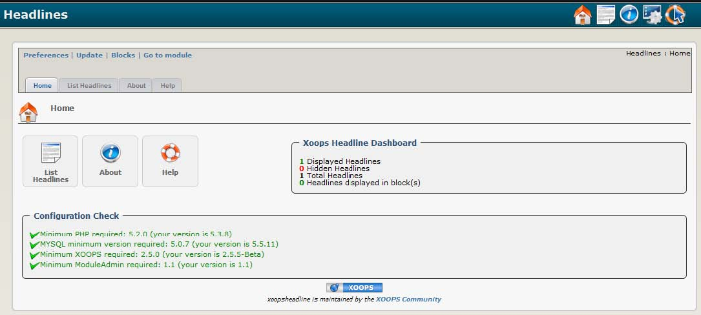

# Introduction

## Module XoopsHeadline

#### for XOOPS 2.5.7

### User Manual

© 2016 XOOPS Project \([www.xoops.org](http://xoops.org)\)

### Module Purpose

“XOOPS Headlines” module allows you to display RSS/XML news feeds from other websites. A news feed is a file summarizing elements of a site’s content, a service commonly provided by dynamic websites. Linking to the feed allows you to display ‘headlines’ and other content from the remote site on your own that will update automatically as the remote site changes. This module is typically used as a news aggregator or syndication tool.

Note that the XOOPS core system generates its own built in RSS feed, accessible from [http://www.yourdomain.com/backend.php](http://www.yourdomain.com/backend.php). Some XOOPS modules generate additional module-specific feeds.

  
_Figure 1 Main view of the XOOPS Headlines Module \(Admin side\)_

### Download/Fork the Module 

**You can fork the module --&gt;** [**here**](https://github.com/XoopsModules25x/xoopsheadline)**\)**

### How to Contribute

[You can contribute on GitHub](https://github.com/XoopsDocs/headline-tutorial). Changes will be [pushed to Gitbook.io automatically](https://www.gitbook.com/book/xoops/headline-tutorial/activity) when the [main repository](https://github.com/XoopsDocs/headline-tutorial) changes.

Editing the book can be done either by updating the markdown files with a text editor, or opening the repository in [the Gitbook desktop app](https://github.com/GitbookIO/editor/blob/master/README.md). The desktop app will give you a live preview option.

## Table of Content

* [Install/Uninstall](install-uninstall.md)
* [Administration Menu](administration-menu.md)
* [Preferences](preferences.md)
* [Operating Instructions](operating-instructions.md)
* [The User Side](the-user-side.md)
* [Blocks](blocks.md)
* [Templates](templates.md)
* [Miscellaneous](https://github.com/XoopsDocs/xoopsheadline-tutorial/tree/358d5112f0997bbdf88a70c73cbd091d25ade2bd/en/book/8other.md) 
* [Module Credits](module-credits.md)
* [About XOOPS CMS](about-xoops-cms.md)

### License:

  
Unless specified, this content is licensed under a [Creative Commons Attribution-NonCommercial-ShareAlike 4.0 International License](http://creativecommons.org/licenses/by-nc-sa/4.0/).

All derivative works are to be attributed to XOOPS Project \(www.xoops.org\)

