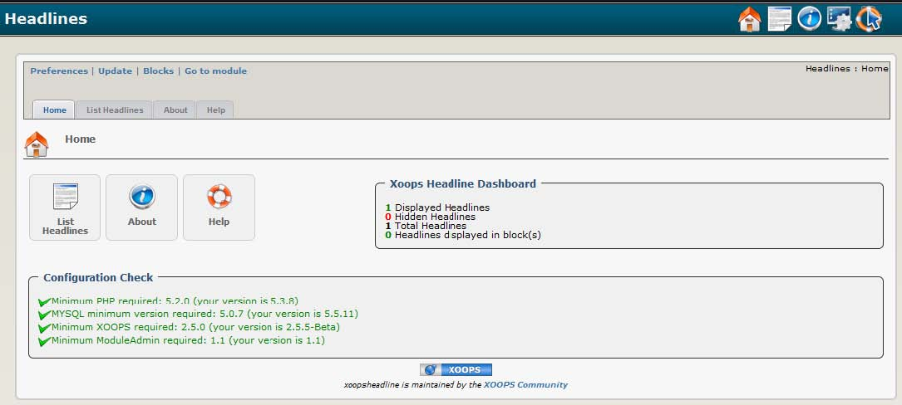

### _XOOPS Documentation Series_

# Module XoopsHeadline
#### for XOOPS 2.5.7
  
      

            
                
                
    
## User Manual
  
  
  
  
  
© 2014 The XOOPS Project (www.xoops.org)    
  

## Module Purpose 

 
“XOOPS Headlines” module allows you to display RSS/XML news feeds from other websites. A news feed is a file summarizing elements of a site’s content, a service commonly provided by dynamic websites. Linking to the feed allows you to display ‘headlines’ and other content from the remote site on your own that will update automatically as the remote site changes. This module is typically used as a news aggregator or syndication tool.

Note that the XOOPS core system generates its own built in RSS feed, accessible from http://www.yourdomain.com/backend.php. Some XOOPS modules generate additional module-specific feeds.

 
  
*Figure 1 Main view of the XOOPS Headlines Module (Admin side)*

# Table of Content

* [Install/Uninstall](book/1install.md)
* [Administration Menu](book/2administration.md)
* [Preferences](book/3preferences.md)
* [Operating Instructions](book/4operations.md)
* [The User Side](book/5userside.md)
* [Blocks](book/6blocks.md)
* [Templates](book/7templates.md)
* [Module Credits](book/9credits.md)