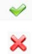
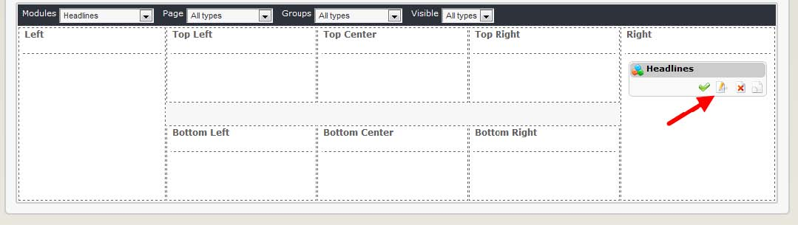

# 6.0 Blocks

The Headlines block simply displays links to the content of the feeds you have listed. 
 

  
*Figure 9 Headlines seen live on the your Website*

If you set “Display in Block” to “Yes” in the Headlines preferences, you can now see them here. 

In this case, the block is linking to two separate websites that provide articles about XOOPS and Sports from Yahoo. Clicking on the title of the site, for example “XOOPS Official Website” will open the URL listed as the feed’s home page, while clicking on a ‘headline’ will open an individual article on the remote site. In either case, the remote site will open in a new window.

This is done by using blocks. To manage blocks,  click on the “Blocks” link in the module’s Administration:
 
  

When you click on the top menu “Blocks” you’ll be redirected to the Blocks screen, with the Headlines blocks already filtered out for you:    
 
  
 
Headlines Module provides you with only one block. First, let’s move the block to the Right position, and set the block to be visible by clicking on the “visibility” icon, which can have two states:

  

  Visible (on-line)
    invisible (off-line)

Now that we have it visible, let’s edit it by clicking on the “Edit” icon:   

  
 
Now the “Block Edit” screen will open up:

   
  
These are the options that we need to change:

|Option|	Action|
|--|--|
|Block Type|	This to select the location where you want the block to be visible. We have already selected the Center Block – Center|
|Weight|	If you have several block and want to control their order, you should set the Weight here, and the blocks will be sorted by their assigned weight. “0” is the highest, and the higher the number, the lower the position of the block5 |
|Visible|	This has to be set to “Yes” if you want to make it visible|
|Visible in|	Here you can select which modules you want this block to be visible in. The first two choices are the most common: either on the Top Page (which is the page you see when you first get to the Website), or on all pages. Or you can select individual module, or any combination of them |
|Title|	You can change to  a name that is more meaningful for your users|
|Content|	 Edit Template	This is only if you would like to make some changes to how the block is presented|
|Cache lifetime|	If the module is not frequently updated or presenting live data, it is useful to set a cache so the block won’t be generate every time opens a page   this will save some resources on your server|
|Group|	Here you can select the groups that you want to see the block|

Most of the time you can leave it as it is.

Once the block is set correctly and made visible, the Headlines can be seen on the User side:
  
